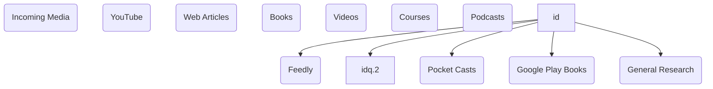

```mermaid
graph TD
%% Top Node
id1(Incoming Media)
id1.1(Feedly)
id1.2(YouTube)
id1.3(Pocket Casts)
id1.4(Google Play Books)
id1.5(General Research)

%%Types of media
id2.1(Web Articles)
id2.2(Books)
id2.3(Videos)
id2.4(Courses)
id2.5(Podcasts)

id --> id1.1 & idq.2 & id1.3 & id1.4 & id1.5
```
